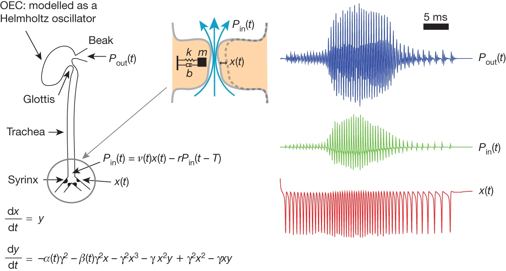

# Zebra finch vocal organ model fitting

Fit the Mindlin lab's model of the avian vocal organ to zebra finch songs, extract biomechanical control parameters, and synthesize vocalizations.

## Overview

This repository provides tools to:
- **Extract biomechanical parameters** from zebra finch song recordings
- **Synthesize song** from biomechanical control trajectories  

The code implements a physics-based differential equations model of the zebra finch syrinx, allowing you to convert between audio waveforms and the underlying physiological control signals.

## Model Description

### The avian vocal organ model

*Dynamical systems model describing syringeal labial dynamics and tracheal vocal-tract filtering. The labia are modeled as a damped mass–spring system. Normal form equations for labial displacement (x(t), red) are integrated to compute input pressure at the vocal tract (Pₙᵢₙ(t), green), filtered by the oro-oesophageal cavity (OEC), yielding total output pressure (Pₒᵤₜ(t), blue). γ, time constant; r, tracheal reflection coefficient; T, tracheal propagation time; v, mean flow velocity parameter; y, velocity. Adapted from Amador, A., et al. (2013). Nature.*

**This is a coupled source-filter system modeling the avian vocal organ:**

- **Syringeal source**: A nonlinear oscillator that generates sound through coupled differential equations
- **Vocal tract resonator**: A delay-line model simulating acoustic wave propagation through the vocal tract

**The model is controlled by two physiological parameters:**

- **α**: air sac pressure parameter
- **β**: syringeal muscle tension parameter

These represent the "control knobs" a bird uses to modulate pitch and amplitude during singing.

### Hyperparameters

The vocal organ hyperparameters (`sys_pars`: `gamma`, `Ch_inv`, `Lb_inv`, `Lg_inv`, `Rb`, `Rh`, vocal tract length) are **fitted to zebra finch anatomy**. Users could adapt the code for other species by re-fitting these physical parameters.

## Features

### 1. Pitch Estimation (`get_pitch`)

The model can only produce sounds with harmonic stacks, therefore in every frame of a vocalization, a pitch must be estimated. This is defined as the lowest frequency the bird produced in a given frame, even if the sound does not have clear harmonic stacks. The algorithm uses:
- Viterbi-based pitch tracking over prominent spectral peaks
- Harmonic support detection for robust fundamental frequency estimation
- Adaptive smoothing across continuous segments
- **User-tunable hyperparameters** (`pitch_kwargs`) that should be adjusted per bird


*Example of a zebra finch song with estimated pitch overlaid.*

### 2. Biomechanical Parameter Extraction (`song_to_parameters`)
Converts song waveforms into control parameters:
- Input: Audio waveform + voicing mask
- Output: α(t) and β(t) trajectories that reproduce the song's pitch and amplitude

### 3. Song Synthesis (`synthesize_song`)
Generates audio from biomechanical parameters:
- Supports multiple numerical integrators (Euler, Heun, RK4)
- GPU-accelerated batch processing or CPU multiprocessing


*Figure: Example fit showing original song, extracted α and β trajectories, and song reconstructed from biomechanical control trajectories.*


## Usage

```python
import numpy as np
from scipy.io import wavfile

# Load your song (48kHz sampling rate for best accuracy)
fs_audio = 48000
y, _ = wavfile.read('zebra_finch_song.wav')
vmask = # ... your voicing/syllable mask (boolean array, same length as STFT frames)

# Analysis parameters
hop_length = int(0.004 * fs_audio)  # 4ms
win_length = int(0.005 * fs_audio)  # 5ms
n_fft = 2048

# 1. Extract biomechanical parameters
pitch_kwargs = {
    'f0_min': 300.0,
    'f0_max': 4000.0,
    'noise_margin_db': 6.0,
    'min_prominence_db': 5.0,
    'transition_weight': 0.01,
    'harmonic_bonus': 5.0,
    # ... tune these per bird!
}

alpha, beta, fit_result = song_to_parameters(
    waveform=y,
    fs_audio=fs_audio,
    vmask=vmask,
    hop_length=hop_length,
    win_length=win_length,
    n_fft=n_fft,
    pitch_kwargs=pitch_kwargs
)

# 2. Synthesize song from parameters
reconstructed = synthesize_song(
    alpha=alpha,
    beta=beta,
    fs_audio=fs_audio,
    len_targ=len(y),
    steps_per_sample=8,
    integrator='heun'
)
```

### Visualize the Fit

```python
# plot amplitude fit and parameter trajectories
fitter.plot_fit(
    birdsong_pitch=fit_result['pitch'],
    birdsong_amplitude=fit_result['amplitude'],
    fit_result=fit_result,
    voicing_mask=vmask
)
```

## Important Notes

### Sampling Rate
- The pre-computed parameter sweep was generated at **fs = 48 kHz**
- Other sampling rates will probably work fine but may introduce small numerical differences due to different integration timesteps

### Hop Length
- The default 4ms hop length is just a recommendation, **users can use different hop lengths**

### Pitch Fitting Hyperparameters
The `pitch_kwargs` parameters in `get_pitch()` are **highly dependent on your specific recordings**. You may need to tune these per bird, recording quality, or dataset:

- `f0_min`, `f0_max`: frequency search range
- `noise_margin_db`: dB threshold above noise floor  
- `min_prominence_db`: peak prominence requirement
- `transition_weight`: Viterbi smoothness penalty
- `harmonic_bonus`: reward for harmonic support
- `harmonic_tolerance`: tolerance for harmonic matching (default 0.15 = ±15%)
- `n_harmonics_check`: number of harmonics to check
- `freq_boost_exp`: low-frequency bias strength

## Parameter Sweep Details

The code includes a pre-computed lookup table mapping (α, β) → (pitch, amplitude):
- **Grid**: 500 × 500 points covering the physiologically valid parameter space
- **Pitch range**: Spans the zebra finch vocal range
- **SNILC cusp**: β is constrained below the Saddle-Node on Invariant Limit Cycle bifurcation boundary
- **File**: `a_b_sweep.pkl`

## Citations

**Model and physiological parameter interpretation:**
> Sanz Perl, Y., et al. (2011). Reconstruction of physiological instructions from Zebra finch song. *Phys Rev E Stat Nonlin Soft Matter Phys*, 84:051909.

**Original vocal tract model, SNILC bifurcation and vocal organ dynamics:**
> Mindlin, G. B., & Laje, R. (2005). *The Physics of Birdsong*. Springer.
